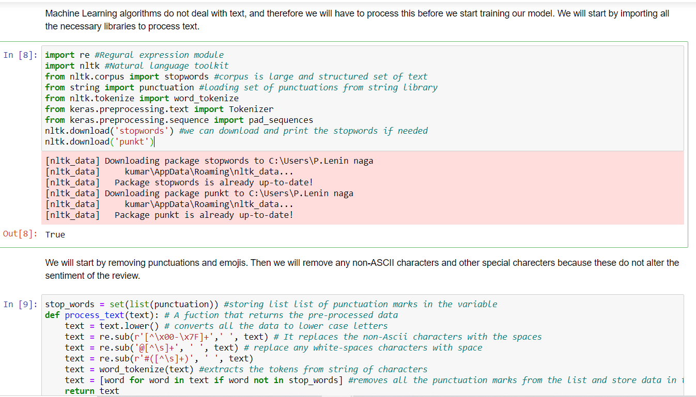

# Analysing-Sentiment-in-Student-Feedback-using-Supervised-Machine-Learning-methods


## Table of Contents

1. [Project Description](#Project-description)
2. [Directory Layout](#directory-layout)
3. [set up and execution](#set-up-and-execution)
4. [Data Set](#data-set)
5. [Loading Libraries](#loading-libraries)
6. [Data Preprocessing and Preparation](#Data-Preprocessing-and-preprocessing)
7. [Model Building and Evaluation](#Model-Building-and-Evaluation)
8. [Sentiment prediction](#sentiment-prediction)
9. [Data Visualization](#data-visualization)
10. [License](#License)
11. [Project Status](#project-status)
12. [Author](#Author)

## Project Description

The project is about the analysing the senitment of the student feedback using the supervised machine learning algorithms using python programming language. Information about user’s sentiment is used for a variety of purposes, such as determining their opinion, attitude towards a business or a product. Whereas with the students’ sentiments it can be used to address issues such as learning experience, teaching, and evaluation etc. Analysing sentiment from the Textual feedback manually is a tedious task and require a lot a of time. This project proposes the methods for analysing sentiment in the student feedback using supervised machine learning models such as Decision Trees, Gaussian Na¨ıve Bayes (GNB), Random Forest. This project analysis the sentiment feedback data set and finds the evaluation metrices like Accuracy, Precision, Recall, f1-Score.
- You can understand about the project clearly from the table of contents which gives details about libraries, installation steps, Data set etc.
- If any one have any queries about the project message me in twitter: 

## Directory Layout

```
- README.md ----> This file you are reading which has all the instructions and clear explanation of the project.
- images ---> This file contains all the files that are used in the readme file.
- StudentFeedbackML.ipynb ---> This file contains the actual code of the project and detailed description about each block.
- feedback dataset.csv ---> This folder contains the dataset used for the project.
```

## Set up and Execution

This project is done using the Jupyter notebook which is preinstalled in anaconda software. The Anaconda for individual edition can be downloaded from here: [Anaconda](https://www.anaconda.com/products/individual) According to the system requirements download 64-bit or 32-bit windows version and it is available to Windows, Mac and Linux systems.
- The required packages are installing tensor flow
```py
pip install tensorflow

```
- After this the jupyter note book is ready with running machine learning python code that is suffucient for our project
- Refer to the code document in our repository [Code File](https://github.com/Raju9936/Analysing-Student-Feedback-using-Machine-Learning/blob/main/StudentFeedbackML.ipynb) download it and upload to jupyter notebook and also make sure the data set is also placed in same folder 
- Download data set from our repository click here [Data Set](https://github.com/Raju9936/Analysing-Student-Feedback-using-Machine-Learning/blob/main/feedback%20dataset.csv)
- After this you are good to go to find the polarity of the sentiment in the feedback.
- In the following steps we included the necessary libraries and packages required to run our code and clear documentation, description of each block of code is available in our code repository click here [Code](https://github.com/Raju9936/Analysing-Student-Feedback-using-Machine-Learning/blob/main/StudentFeedbackML.ipynb)

## Data Set
- The Data set is extracted from the kaggle open source 
(Source: https://www.kaggle.com/chandusrujan/sentimental-analysis-on-student-feedback retrieved in july 2021.)
- The Data set can be found in our repository : [Data Set](https://github.com/Raju9936/Analysing-Student-Feedback-using-Machine-Learning/blob/main/feedback%20dataset.csv)
- The Data set consists of 2 coloums reviews and the sentiment either 1 or 0
- The Data set consists of 5200 rows and it is balanced data set with almost equal number of postive and negative reviews

## Loading Libraries 

```py
import warnings
import numpy as np #Importing the necessary numeric data packages and data analysis packages
import pandas as pd
import re #Regural expression module
import nltk #Natural language toolkit
from nltk.corpus import stopwords #corpus is large and structured set of text
from string import punctuation #loading set of punctuations from string library
from nltk.tokenize import word_tokenize
from keras.preprocessing.text import Tokenizer
from keras.preprocessing.sequence import pad_sequences
from sklearn.model_selection import train_test_split
from sklearn.metrics import accuracy_score,precision_score,recall_score,f1_score# importing the error metrices from sklearn library
from sklearn.naive_bayes import GaussianNB#importing the Gaussian Naive bayes algorithm 
import seaborn as sns#importing seaborn library for graphics
%matplotlib inline 
from matplotlib import pyplot as ply
from sklearn.tree import DecisionTreeClassifier#importing Decision tree classifier algorithm
from sklearn.ensemble import RandomForestClassifier #importing the Random forest algorithm 
```

## Data Pre-processing and preparation
- The dataset is preprocessed to remove unwanted rows and stop words, punctuations etc. The Data is converted into tokens.
- The Data set is converted into the Array of sequences so, that it can be fed easily to get trained by machine learning model.



## Model Building and Evaluation
- The Gaussian naive bayes, Decision tree Classifier, Random forest models were trained and evaluation metrices were determined.
- The Random Forest model has performed better with our data Set giving accuracy greather than 80 percent.
- Gaussian Naive Bayes-51
- Decision Trees-78
- Random Forest- 81
- The Evaluation metrices measured were Accuracy, Precision, Recall, f1-Score.
- Below Random Forest Model is Attached for all other models refer to code file click here [Code Document](https://github.com/Raju9936/Analysing-Student-Feedback-using-Machine-Learning/blob/main/StudentFeedbackML.ipynb)


## Sentiment Prediction
- The sentiment of the given review is predicted as follows the Random forest model gave good accuracy so, using that trained model we predicted the review sentiment


## Data Visualization
- In this project I did some some work on visualizing the results 
- The Accuracy Score, Precision, Recall, f1-scores are visualized for all the three algorithms that I used in our project.


## License 
- This project has no license it is open source for now

## Project Status
- The Analysis and evaluation of 3 machine algorithms were done on student feedback data set and obtained good accuracy score for the Random Forest model.
- The accuracy that is obtained is 80 percent but by including more data points to the data set the model can perform better and can obtain 90 percent accuracy.
- Also, on this data if Recurrent Neural Networks were trained we can anticipate better results.
- For better understanding the project refer to the ipynb file in the repository refer this [Code Document](https://github.com/Raju9936/Analysing-Student-Feedback-using-Machine-Learning/blob/main/StudentFeedbackML.ipynb)
- For Any doubts regarding the project message me in twitter 


## Author
- Lenin Naga Kumar Polukonda  

